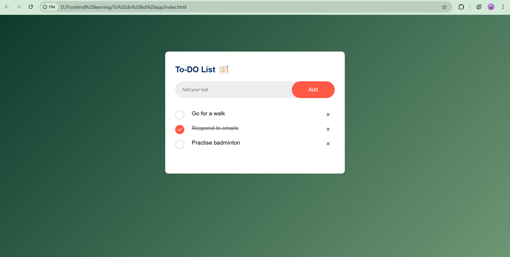

# To-Do List Web App

A simple and interactive web application for managing daily tasks. This to-do list app is built using HTML, CSS, and JavaScript and includes local storage functionality to save tasks even after the browser is closed.

## Features
- Add, edit, and delete tasks.
- Mark tasks as completed.
- Persist tasks using the browser's local storage.

## Screenshots

## Technologies Used
- HTML5 for structuring the app.
- CSS3 for styling and layout.
- JavaScript for functionality and DOM manipulation.
- Local Storage for data persistence.
